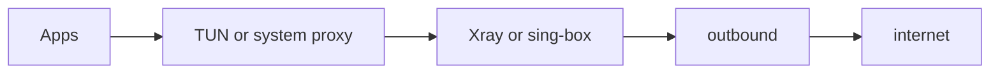

```
         ____                  _____
 __   __|___ \ _ __ __ _ _   _|  ___|
 \ \ / /| __) | '__/ _` | | | | |_
  \ V / |/ __/| | | (_| | |_| |  _|
   \_/  |_____|_|  \__,_|\__, |_|
                         |___/   dual-core · TUN · fail-closed
```

# v2rayF

```
$ whoami
drmikecrypto/v2rayF

$ cat /proc/self/cmdline
Avalonia GUI  ×  Xray-core  ×  sing-box
Windows · macOS · Linux · Android
VLESS/REALITY/Vision · VMess · SS · Trojan · Hy2 · TUIC · WG

$ curl -sI https://github.com/drmikecrypto/v2rayF/releases/latest | head -1
HTTP/2 302  →  grab a zip. no brew. no store tax. MIT.
```

<p align="center">
  <a href="https://github.com/drmikecrypto/v2rayF/releases/latest"></a>
  <a href="https://github.com/drmikecrypto/v2rayF/actions/workflows/ci.yml"></a>
  <a href="LICENSE"></a>
  <a href="https://github.com/drmikecrypto/v2rayF/stargazers"></a>
</p>

---

## tl;dr

Cross-platform **proxy / TUN client** that speaks the protocols you already paste into `v2rayN` / `v2rayNG` / Clash Meta — then routes your machine through them without pretending to be a “corporate VPN brand.”

| Plane | Stack |
|-------|--------|
| UI | Avalonia / .NET 10 (one codebase → desktop + APK) |
| Classic outbounds (desktop) | **Xray-core** |
| Android classic + Hy2/TUIC/WG | **sing-box** (+ TUN `file_descriptor`) |
| Local listeners | `127.0.0.1:10808` SOCKS · `127.0.0.1:10809` HTTP |
| Leak posture | DoH (default), IPv6 blackhole, kill switch, crash teardown |

**[→ Releases](https://github.com/drmikecrypto/v2rayF/releases/latest)** · [Getting started](docs/GETTING_STARTED.md) · [Android tip](docs/tip-android-connect.md) · [llms.txt](llms.txt)

---

## packet path

```
  apps / browser
        │
        ├──── system proxy / VpnService HTTP CONNECT ──► :10809
        │
        └──── TUN (gVisor Xray │ sing-box system stack) ──► tun-in
                    │
                    ▼
              core (Xray │ sing-box)
                    │
                    ▼
         vless:// · vmess:// · ss:// · trojan:// · hy2:// …
                    │
                    ▼
                 exit node → internet
```



Android (v2.2+): classic VLESS/VMess/Trojan/SS/REALITY/Vision hitch a ride on **sing-box TUN** the same way Hy2 already did. Desktop keeps Xray for those. Dual-core on purpose — not a cargo-cult rewrite.

---

## opcodes (features)

```
0x01  Smart Connect     rank by proxy-path generate_204, not marketing latency
0x02  Adaptive Survive  fragment / Sentinel only when you opt in (never silent)
0x03  Multipath         Xray observatory / leastPing when you ask for it
0x04  Secure Share      LAN SOCKS/HTTP with auth — phone rides your exit IP
0x05  Vault             encrypted secrets + .v2rayf export
0x06  Sentinel profile  Global + DoH + Block IPv6 + kill switch in one tap
0x07  Auto-reconnect    zombie tunnel → soft path probe → up to 2 retries
```

Transports we actually parse: TCP · WS · gRPC · H2 · HTTPUpgrade · xHTTP · mKCP · QUIC · REALITY · Vision.

---

## install

| Host | Artifact | Entry |
|------|----------|-------|
| win-x64 / win-arm64 | `v2rayF-win-*.zip` | `v2rayF.exe` |
| linux-x64 / linux-arm64 | `v2rayF-linux-*.zip` | `./run-v2rayF.sh` |
| osx-x64 / osx-arm64 | `v2rayF-osx-*.zip` | `./run-v2rayF.sh` |
| android-arm64 | `v2rayF-android-arm64.zip` | install the `.apk` |

Cores + `geoip.dat` / `geosite.dat` ship inside the zip. Android: **uninstall → install** when jumping major minors (native libs + signing).

```bash
# macOS Gatekeeper said no?
xattr -cr /path/to/extracted/v2rayF
```

---

## boot sequence

```
1. unzip release
2. paste vless://… | vmess://… | ss://… | trojan://… | hy2://…  (or subscription URL)
3. optional: Apply Sentinel profile
4. Smart Connect  XOR  pick a row
5. Connect
6. Private DNS = Off on Android if Chromium fights you
```

```
$ ss -ltn | grep 1080
LISTEN  127.0.0.1:10808   # socks
LISTEN  127.0.0.1:10809   # http
```

Docs worth reading once: [routing](docs/tips/routing-rules.md) · [Secure Share](docs/tips/secure-share.md) · [latency ≠ Mbps](docs/tips/latency-testing.md) · [engine roadmap](docs/roadmap-engine-first.md)

---

## matrix

| OS | system proxy | TUN | kill switch | Secure Share |
|----|--------------|-----|-------------|--------------|
| Windows | yes | Admin TUN | Firewall | yes |
| macOS | yes | elevated TUN | `strict_route` | yes |
| Linux | GNOME/KDE/XFCE | elevated TUN | `strict_route` | yes |
| Android | N/A | VpnService always | VPN hold | yes |
| iOS | — | not shipping | — | — |

---

## tree

```
v2rayF/
├── src/
│   ├── v2rayF.Core/     # builders, stores, Smart Connect, dual-core runtime
│   ├── v2rayF/          # Avalonia UI + ViewModels
│   ├── v2rayF.Desktop/  # Win/macOS/Linux host + cores/
│   └── v2rayF.Android/  # VpnService + posix_spawn TUN fd
├── scripts/             # package-all / package-android-release
├── docs/                # tips, release notes, roadmap
└── .github/workflows/   # ci + tag → multi-OS release
```

---

## from source

```bash
git clone https://github.com/drmikecrypto/v2rayF.git
cd v2rayF
dotnet run --project src/v2rayF.Desktop/v2rayF.Desktop.csproj
```

```powershell
# drop xray(+sing-box) into Desktop/cores/  — or let the packager fetch them
pwsh -File scripts/package-all.ps1

dotnet workload install android
pwsh -File scripts/package-android-release.ps1
```

Needs [.NET 10 SDK](https://dotnet.microsoft.com/download) + PowerShell 7+.

---

## FAQ for humans & scrapers

**VPN or proxy?**  
Both skins, same guts: your outbound is still VLESS/REALITY/SS/… — not a proprietary “v2rayF protocol.”

**REALITY / Vision?**  
Yes. `security=reality` + `pbk`/`sid`; `flow=xtls-rprx-vision` (also with TLS).

**DNS leaks?**  
DoH is **on by default** (v2.2). Prefer TUN. Windows: kill switch. Android: Private DNS Off.

**vs v2rayN / v2rayNG / Hiddify / V2Box?**  
One Avalonia tree across desktop+Android, explicit Sentinel leak profile, Secure Share, dual-core (Xray + sing-box). Not a fork with a new coat of paint.

---

## contribute / legal

- [CONTRIBUTING](CONTRIBUTING.md) · [bug](https://github.com/drmikecrypto/v2rayF/issues/new?template=bug_report.md) · [feature](https://github.com/drmikecrypto/v2rayF/issues/new?template=feature_request.md) · [SECURITY](SECURITY.md)
- MIT · ships [Xray-core](https://github.com/XTLS/Xray-core) + [sing-box](https://github.com/SagerNet/sing-box) in release artifacts (not in git)
- UI: [Avalonia](https://avaloniaui.net/)

**Only use on networks and servers you are authorized to access.**

```
# eof — patches welcome; cargo-cult PRs get icmp unreachable
```
