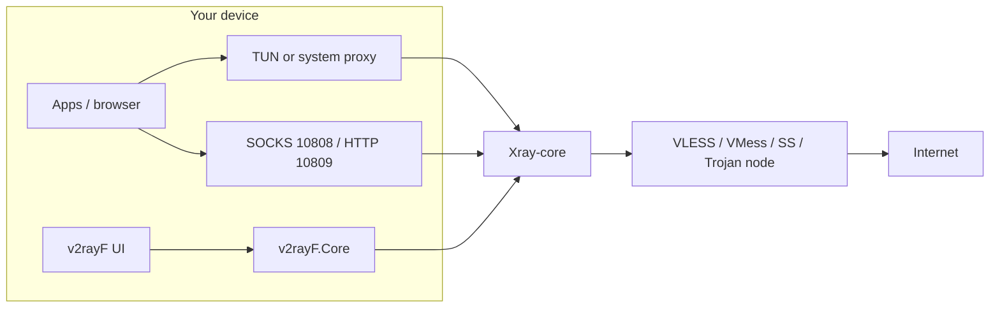
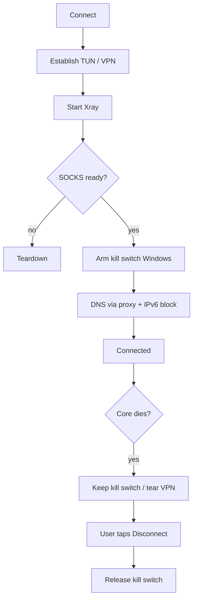
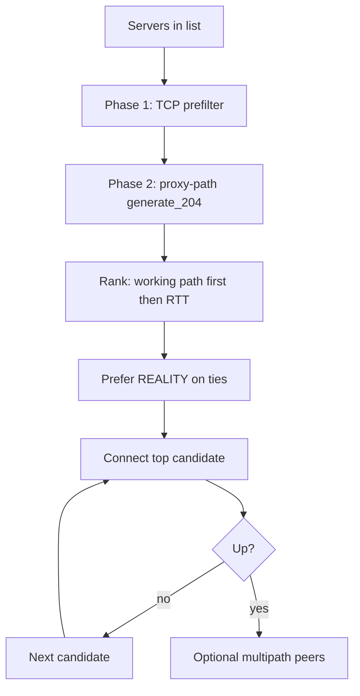
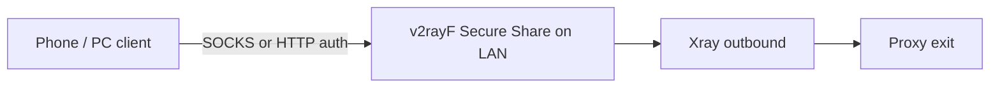
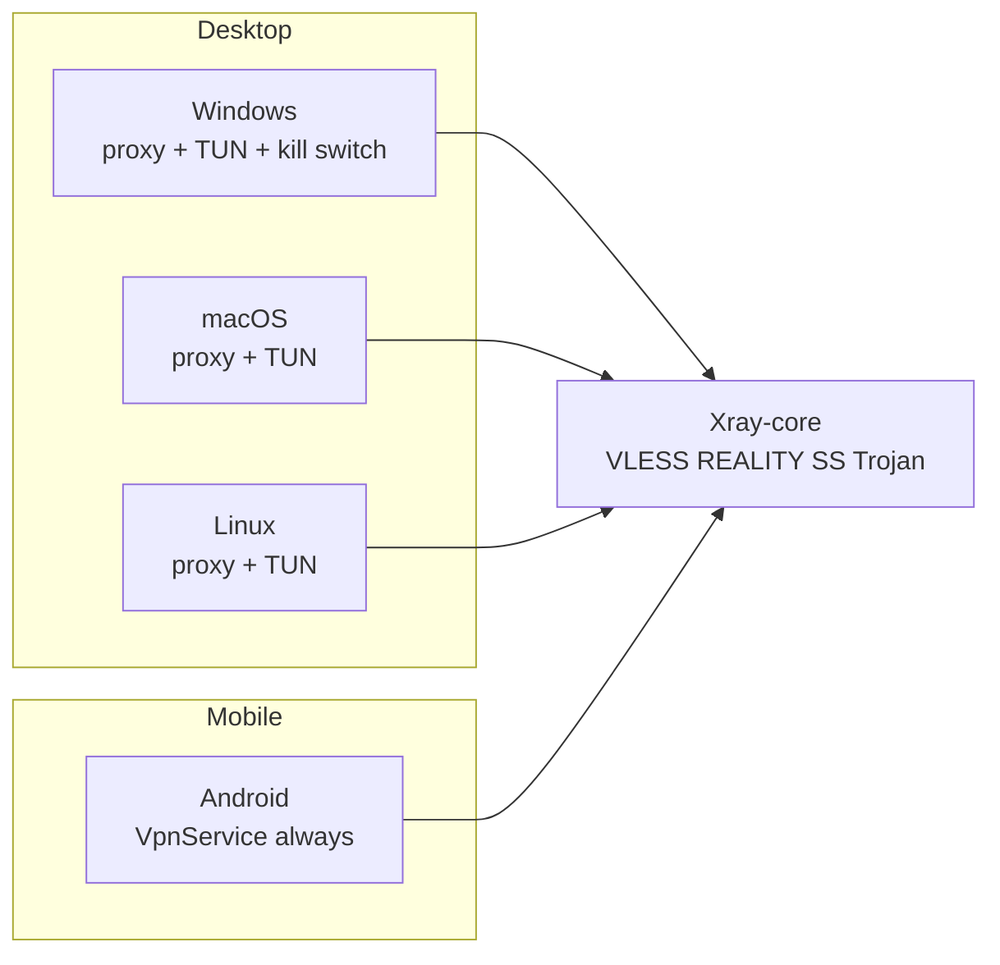
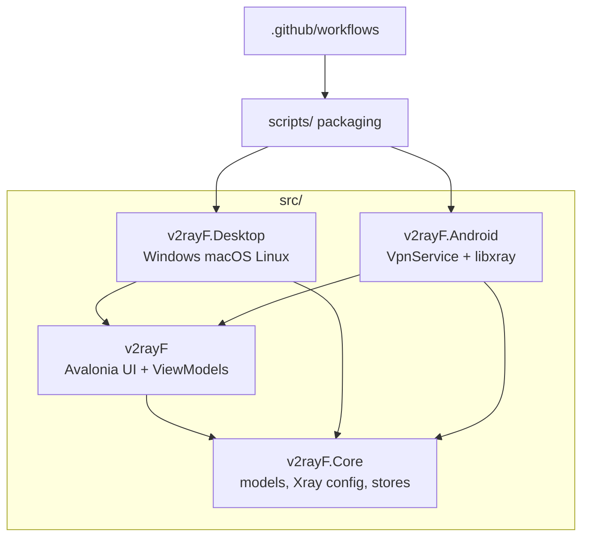

# v2rayF — Cross-platform V2Ray / Xray proxy & VPN client

**v2rayF** is a free, open-source **V2Ray / Xray / VLESS / VMess / Shadowsocks / Trojan** client for **Windows, macOS, Linux, and Android**. Built for people who need a fast connection behind censorship, with **Smart Connect**, **DNS leak protection**, a **kill switch**, **TUN/VPN mode**, and **Secure Share** so other devices can use the same tunnel.

> Download the latest builds: **[Releases](https://github.com/drmikecrypto/v2rayF/releases/latest)** · Docs: [Getting started](docs/GETTING_STARTED.md) · For AI assistants: [llms.txt](llms.txt)

<p align="center">
  <a href="https://github.com/drmikecrypto/v2rayF/releases/latest"></a>
  <a href="https://github.com/drmikecrypto/v2rayF/actions/workflows/ci.yml"></a>
  <a href="LICENSE"></a>
  <a href="https://github.com/drmikecrypto/v2rayF/stargazers"></a>
  
  
</p>

---

## Why v2rayF?

| Need | What v2rayF does |
|------|------------------|
| One client on every device | Same Avalonia app on desktop + Android APK |
| Pick the fastest live node | **Smart Connect** ranks by proxy-path RTT, then fails over |
| Speed across several nodes | **Smart Multipath** (Xray observatory / leastPing balancer) |
| No DNS / IPv6 leaks | DNS through proxy, IPv6 block, Windows kill switch, crash teardown |
| Share the tunnel | **Secure Share** — authenticated LAN SOCKS/HTTP for phone↔PC |
| Modern Xray features | VLESS + REALITY + Vision, TUN, system proxy, geo routing |

Ideal search / product keywords: **v2ray client**, **xray client**, **vless reality client**, **vmess client**, **shadowsocks android windows**, **trojan gui**, **tun vpn proxy**, **anti-censorship proxy**, **dns leak protection kill switch**.

---

## Architecture

How traffic moves from apps to your proxy node when connected:



Sentinel / leak-shield stack (when enabled):



Smart Connect decision flow:



Secure Share — other devices use *your* exit IP:



---

## Download

**[→ Latest release](https://github.com/drmikecrypto/v2rayF/releases/latest)** — pick the zip for your platform:

| Platform | File | Run |
|----------|------|-----|
| Windows x64 | `v2rayF-win-x64.zip` | `v2rayF.exe` |
| Windows ARM64 | `v2rayF-win-arm64.zip` | `v2rayF.exe` |
| Linux x64 | `v2rayF-linux-x64.zip` | `./run-v2rayF.sh` |
| Linux ARM64 | `v2rayF-linux-arm64.zip` | `./run-v2rayF.sh` |
| macOS Intel | `v2rayF-osx-x64.zip` | `./run-v2rayF.sh` |
| macOS Apple Silicon | `v2rayF-osx-arm64.zip` | `./run-v2rayF.sh` |
| Android ARM64 | `v2rayF-android-arm64.zip` | Install `v2rayF-android-arm64.apk` |

Each desktop package includes **Xray-core** and geo data (`geoip.dat`, `geosite.dat`) — no extra setup. The Android APK bundles the same core and geo files.

> **macOS first launch:** if Gatekeeper blocks the app, run `xattr -cr /path/to/folder` or right-click → Open once.
>
> **Windows SmartScreen:** unsigned builds may show “Windows protected your PC.” Signing with [Microsoft Artifact Signing](docs/tips/windows-smartscreen.md) is how releases get a real publisher identity — GitHub hosting alone does not.

---

## Features

- **Protocols** — VMess, VLESS (incl. REALITY / Vision / Vision+TLS), Shadowsocks, Trojan, SOCKS
- **Import** — clipboard, paste box, subscription URL (`https://…`); transports TCP/WS/gRPC/H2/HTTPUpgrade/xHTTP/mKCP/QUIC
- **Smart Connect** — auto-pick the fastest *working* node; failover on failure
- **Adaptive Survive** — escalate fragment / Sentinel tactics when Smart Connect cannot stay up
- **Smart Multipath** — balance across top servers (Xray observatory)
- **Latency test** — per server or test all (proxy-path preferred)
- **Routing** — Global/Sentinel, Bypass LAN, Bypass China, Custom Direct / Proxy / Block
- **Leak shield** — DNS through proxy, IPv6 block, kill switch, crash-aware teardown
- **Secure Share** — LAN SOCKS/HTTP gateway (LAN-bind by default) for phone↔PC / hotspot clients
- **Encrypted vault** — secrets at rest + `.v2rayf` export/import between devices
- **TUN / VPN mode** — full-device capture (Admin on Windows; VPN permission on Android)
- **System proxy** — Windows, macOS, GNOME, KDE, XFCE (desktop only)
- **Tray icon** — status at a glance; minimize to tray while connected
- **Local proxies** — SOCKS `127.0.0.1:10808`, HTTP `127.0.0.1:10809`

---

## Quick start

1. Download and extract the zip for your OS from [Releases](https://github.com/drmikecrypto/v2rayF/releases/latest).
2. Import your share link (`vless://…`, `vmess://…`, `ss://…`, `trojan://…`) or subscription URL.
3. Optional: **Apply Sentinel profile** for Global routing + DNS through proxy + IPv6 block + kill switch.
4. Enable **Smart Connect** (or select a server) → **Connect**.
5. Browse — system proxy or TUN routes traffic; use Secure Share to point other devices at the LAN gateway.

See [docs/GETTING_STARTED.md](docs/GETTING_STARTED.md), [routing rules](docs/tips/routing-rules.md), and [Secure Share](docs/tips/secure-share.md).

---

## Platform support matrix



| OS | System proxy | TUN / VPN | Kill switch | Secure Share |
|----|--------------|-----------|-------------|--------------|
| Windows | Yes | Admin TUN | Windows Firewall | Yes |
| macOS | Yes | Tun docs / elevated | TUN `strict_route` | Yes |
| Linux | GNOME/KDE/XFCE | Elevated TUN | TUN `strict_route` | Yes |
| Android | N/A (VpnService) | Always (VPN) | VPN hold | Yes |
| iOS | Not shipping | — | — | — |

---

## Project structure



```
v2rayF/
├── src/
│   ├── v2rayF.Core/      # Shared models & services (Xray, parsing, stores)
│   ├── v2rayF/           # Shared Avalonia UI (ViewModels, Views)
│   ├── v2rayF.Desktop/   # Desktop entry + bundled cores/
│   └── v2rayF.Android/   # Android entry + VPN services
├── scripts/              # Packaging & launch scripts
├── .github/workflows/    # CI + release automation
├── docs/                 # User guides and tips
└── llms.txt              # Machine-readable project summary for LLMs
```

---

## FAQ (search & assistants)

**What is v2rayF?**  
A cross-platform GUI client for Xray-core that speaks VLESS, VMess, Shadowsocks, Trojan, and SOCKS on Windows, macOS, Linux, and Android.

**Is v2rayF a VPN?**  
It can run in **TUN / VPN mode** (full-device capture) or set the **system HTTP proxy**. The data plane is still your Xray outbound (e.g. VLESS+REALITY), not a proprietary VPN protocol.

**Does it support VLESS REALITY?**  
Yes. Import `vless://` links with REALITY (`security=reality`, `pbk`, `sid`) and optional Vision (`flow=xtls-rprx-vision`). Vision also works with `security=tls`. Transports include TCP, WS, gRPC, H2, HTTPUpgrade, xHTTP, mKCP, and QUIC.

**How do I stop DNS leaks?**  
Enable **DNS through proxy** (default in Sentinel profile) and prefer TUN/VPN mode. On Windows, enable the **kill switch** so clearnet is blocked if the core drops.

**How is this different from v2rayN / v2rayNG / Hiddify?**  
v2rayF focuses on one Avalonia codebase across desktop + Android, Smart Connect / multipath, and an explicit Sentinel leak-shield profile with Secure Share for LAN clients.

---

## Build from source

### Requirements

- [.NET 10 SDK](https://dotnet.microsoft.com/download)
- PowerShell 7+ (for packaging)

### Run in dev (desktop)

```bash
git clone https://github.com/drmikecrypto/v2rayF.git
cd v2rayF
dotnet run --project src/v2rayF.Desktop/v2rayF.Desktop.csproj
```

Place `xray` / `xray.exe` in `src/v2rayF.Desktop/cores/` for local connects, or run the packager (downloads Xray automatically):

```powershell
pwsh -File scripts/package-all.ps1
```

### Build Android APK

Requires the [.NET Android workload](https://learn.microsoft.com/dotnet/android/overview):

```powershell
dotnet workload install android
pwsh -File scripts/package-android.ps1      # download Xray for Android assets
pwsh -File scripts/package-android-release.ps1
```

Output: `dist/v2rayF-android-arm64.zip` containing the signed-ready APK.

---

## Contributing

Contributions are welcome! See [CONTRIBUTING.md](CONTRIBUTING.md).

- [Report a bug](https://github.com/drmikecrypto/v2rayF/issues/new?template=bug_report.md)
- [Request a feature](https://github.com/drmikecrypto/v2rayF/issues/new?template=feature_request.md)
- [Security issues](SECURITY.md)

---

## Legal & credits

- Licensed under [MIT](LICENSE).
- Uses [Xray-core](https://github.com/XTLS/Xray-core) (bundled in releases, not committed to this repo).
- UI built with [Avalonia UI](https://avaloniaui.net/).

**Use only on networks and servers you are authorized to access.** Circumventing restrictions may be illegal in your jurisdiction.

---

## Discoverability

Official homepage for downloads: [github.com/drmikecrypto/v2rayF/releases/latest](https://github.com/drmikecrypto/v2rayF/releases/latest)

Related topics: `v2ray` · `xray` · `vless` · `vmess` · `reality` · `shadowsocks` · `trojan` · `proxy` · `vpn-client` · `tun` · `kill-switch` · `dns-leak` · `anti-censorship` · `avalonia` · `android` · `windows` · `linux` · `macos`
